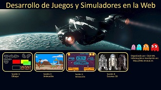

# tecnunhal

## Seminario: Desarrollo de Juegos y Simuladores en la Web
Las aplicaciones en la Web permiten el acceso a las mismas desde cualquier plataforma y sin necesidad de realizar ninguna instalaci&oacute;n. Unido a la capacidad de interaccionar con los distintos modos de control de cada dispositivo (teclado, rat&oacute;n, pantalla), convierte a las aplicaciones en la Web en la plataforma idonea para desarrollar juegos, animaciones, simulacionres y dem&aacute;s tipos de aplicaciones que requieran interacci&oacute;n y una representaci&oacute;n gr&aacute;fica, ya se aen 2D y 3D. Durante el seminario se explicarán y practicará con las técnicas necesarias para el desarrollo de estas aplicaciones.

El seminario de Desarrollo de Juegos y Simuladores en la Web est&aacute; organizado por el club HAL del departamento de Organizaci&oacute;n Industrial. En este seminario colaboran los profesores Nicolás Serrano, Josune Hernantes y Javi Santos.

Para inscribirse, enviar un email a nserrano@tecnun.es, jhernantes@tecnun.es o jsantos@tecnun.es

## ¿Cu&aacute;ndo?
El seminario se realizar&aacute; en 4 sesiones de 1h20' a partir del 15 de enero, con una sesión por semana. Se concretar&aacute; el horario para hacerlo compatible con el mayor número de inscritos.

## ¿Qué se necesita saber previamente?
Conocer el concepto de variable, funci&oacute;n y bucle (por ejemplo habiendo cursado Inform&aacute;tica I). No es necesario el conocimiento de ning&uacute;n lenguaje espec&iacute;fico, puesto que se partir&aacute; desde el inicio con las herramientas a emplear (HTML5 y JavaScript).

## ¿Es convalidable como alumno interno?
Es un seminario y por tanto no es un trabajo equiparable a la labor de alumno interno, ni se piden los requerimientos de ser alumno interno para realizarlo. Si alguno es alumno interno, puede preguntar a su director si esta tarea se puede incluir en su dedicación de alumno interno, para lo cual los profesores del seminario informarán al director del alumno.

## Contenido
### Sesi&oacute;n 1. Dibujar
- Página Web en HTML
- Canvas en una página Web
- Dibujo de elementos b&aacute;sicos: l&iacute;neas, rect&aacute;ngulos, arcos, curvas
- Dibujo de imágenes (sprites)
- El navegador para detectar errores (debugger)

### Sesi&oacute;n 2. Animaci&oacute;n
- Bucles para dibujar distintas posiciones
- Funciones
- Gesti&oacute;n del tiempo en la animaci&oacute;n
- Im&aacute;genes animadas

### Sesi&oacute;n 3. Interacci&oacute;n
- Incluir al usuario en la simulación
- Interacci&oacute;n con el ratón
- Interacci&oacute;n con el teclado
- Interacci&oacute;n con la pantalla (pantallas t&aacute;ctiles)
- Audio

### Sesi&oacute;n 4. Escenas 3D
- WebGL y la librería three.js
- Escena, luces, camara y objetos
- Animación en 3D.

### Cr&eacute;ditos del poster
 - [Drawing](https://nicolasserrano.github.io/pro-html5-games-17/9781484229095/9781484229095_Ch01/chapter1.html) - [Froot Wars](https://www.adityaravishankar.com/projects/games/frootwars/) - [Captain Rogers](http://rogers.enclavegames.com/) - [Scene 3D](https://sketchfab.com/models/23f8c0f80c9641debfbe7b42d1737fb6) - [Main image](https://www.flickr.com/photos/hasgaha/24054984888/in/photostream/) - [Pacman image](http://pacman.wikia.com/wiki/File:Pac-man-ghosts.jpg)

### Club HAL
  
Club del departamento de Organizaci&oacute;n Industrial dedicado al uso creativo de los ordenadores. 
HAL es el nombre del ordenador de la nave de la película [2001: Una odisea del espacio](http://decine21.com/peliculas/2001-una-odisea-del-espacio-7414)
