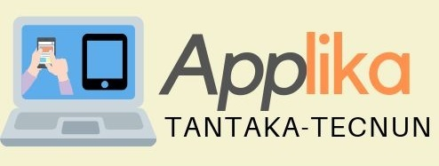

## Seminario: Diseño y Desarrollo de Aplicaciones Web
El serminario **Diseño y Desarrollo de Aplicaciones Web** est&aacute; organizado por el departamento de Organizaci&oacute;n Industrial y el departamento de Ingenier&iacute;a Biom&eacute;dica y Ciencias. El objetivo del mismo es dar los conocimientos b&aacute;sicos para dise&ntilde;ar aplicaciones Web. En la &uacute;ltima sesi&oacute;n se puede optar por aplicarlo al desarrollo de aplicaciones matem&aacute;ticas o para el desarrollo de aplicaciones para voluntariado y ONGs.

  

En este seminario colaboran los profesores Carmen Blanco, Juanfran Car&iacute;as y Nicol&aacute;s Serrano.

**Para inscribirse o m&aacute;s información, contactar o enviar un email** a nserrano@tecnun.es antes del martes 11 de Junio a las 11:00 AM.

## ¿Cu&aacute;ndo?
El seminario se realizar&aacute; en 3 sesiones el mi&eacute;rcoles, jueves y viernes, días 12, 13 y 14 de Junio de 2019 de 9:30 a 11:00.

## ¿Qué se necesita saber previamente?
No es necesario el conocimiento de ning&uacute;n lenguaje espec&iacute;fico, solamente haber cursado la asignatura de Inform&aacute;tica.

## ¿Es convalidable como alumno interno?
Es un seminario y por tanto no es un trabajo equiparable a la labor de alumno interno, ni se piden los requerimientos de ser alumno interno para realizarlo. Si alguno es alumno interno, puede preguntar a su director si esta tarea se puede incluir en su dedicación de alumno interno, para lo cual los profesores del seminario informarán al director del alumno.

Tambi&eacute;n se podr&iacute;a realizar un trabajo posterior como alumno interno si hay un grupo de alumnos interesados.

## Contenido

Las sesiones, de aproximadamente 1:30 horas cada una serán las siguientes:
### Sesi&oacute;n 1. Web
- HTML
  El lenguaje para crear páginas Web.
- CSS
  El diseño de las páginas Web (estilos, colores, fuentes, composición)

### Sesi&oacute;n 2. JavaScript
- JavaScript
  El lenguaje de programación en la Web
- DOM
  Manipulación del HTML y CSS con JavaScript en la propia página Web
- JSON
  Formato de almacenamiento e intercambio de datos con servidoresy su uso con JavaScript

### Sesi&oacute;n 3. Aplicaciones
- Codex
  Herramienta Web para la publicaci&oacute;n y evaluaci&oacute;n de contenido STEM
- GeoGebra
  Creación de widgets con GeoGebra

<table>
  <tr>
    <td width="50%">
  
<B> Applika</B>  Aplicaciones para proyectos de voluntariado y ONGs
    </td>
    <td>
      
  
<B> Club HAL</B>  
Club del departamento de Organizaci&oacute;n Industrial dedicado al uso creativo de los ordenadores.  
HAL es el nombre del ordenador de la película <a href="http://decine21.com/peliculas/2001-una-odisea-del-espacio-7414" >2001: Una odisea del espacio</a>
   
  Ver <a href="https://tecnunhal.github.io/Archivo">seminarios anteriores</a>
    </td>
  </tr>
</table>  

